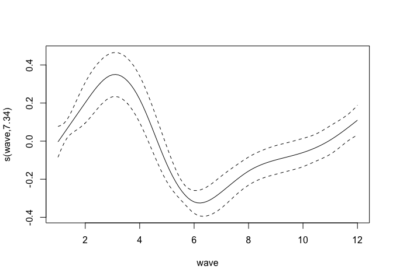
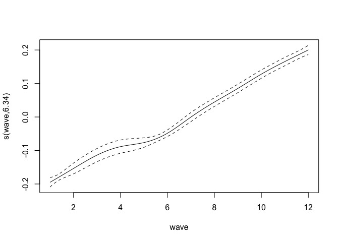
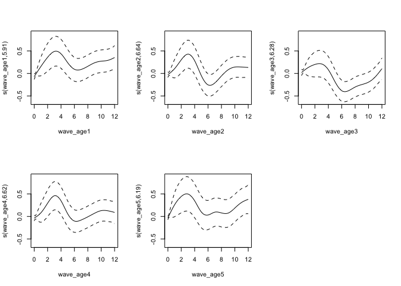

```
## Loading required package: nlme
## This is mgcv 1.8-6. For overview type 'help("mgcv-package")'.
## 
## Attaching package: 'ordinal'
## 
## The following objects are masked from 'package:nlme':
## 
##     ranef, VarCorr
```

# HILDA

Le variabili di Interesse sono edhigh1 (education) e jbmo62 (occupation). 
Come vedi ci sono relativamente pochi immigrati. 
Ti ho inviato un'extraction del pannello (xwaveid e wave). Ci sono 12 osservazioni al massimo ma come vedrai non per tutti.
I salari sono wscei (current weekly wage) e wsfei (Financial year wage) 

Covariates:
ancob: Country of birth
yrivwfst: year first interview
yrivwlst: year last interview
hh*: household...
edcqtyp: Currently studying full or part time
esdtl: Labour force status - detail
esempst: Current employment status
jb*: job... (jbmo62)
helth: Long term health condition
fmfsch: How much schooling father completed
fmmsch: How much schooling mother completed
anlote: Speak language other than English
aneab: How well speaks English
anyoa: Year first came to Australia to live (no anyoan)
anpappn: Australian visa - Primary applicant
anengfn: Is English the first language you learned to speak as a child
edcoqn: Country completed highest education
rtcompn: Retired completely from the workforce
rtyrn: Year retired
jbmoccs: occupational status scale, current main job
tcr: Number of own resident children
tcnr: Number of own non-resident children
hhyng: Age of youngest person in household
hhold: Age of oldest person in household
anmigc: Migration category when you or your family first arrived in Australia: **mostly missings**
fmnsib: How many siblings
edqenr: Ever enrolled in a course of study to obtain a qualification
edcoq: Country completed highest qualification
hgage: Age last birthday at June 30 2012
ehtse: Time since FT (full-time) education - years

## Data

* Load the data and make some home cleaning (details omitted).


```
Warning in findInterval(as.integer(sapply(x$jbmo62, substr, 2, 2)), skill_limits): NAs introduced by coercion
```

## Models suggested by Max:

1. wage = costant + demographics + experience(age-anni scuola) + caract.employer(if available) + location + e
2. participation (0=no,1=yes) = costant + demographics + education + young children + wealth + e

### Variables

* wscei: weekly wage ---> replaced with wsfei (annual wage)
~
* ancob  [immigrato o no] --> replaced with ancob3: 3 categories: au, anglo, others
* edcoq  [education in au]
* edqenr [qualifica in au]
* fmfo61 and/or fmmo61 [figlio di operai]
...controlli...
* aneab [conoscenze inglese: missings born in au replaced with 1:very well]
* anyoa [year of arrival]. For non-migrants, replace with 2012-age_2012
* edagels o edhigh1 [years of education] ---> used edhigh1
* esdtl [participation to labour market]
* hgage [age]
* hgsex [sex]
* marital status [mrcurr]
* hhmsr o hhstate [location]
* jbmo62 [occupation]
* jbmwpsz [no employees]
* jbocct [tenure current job]
* ehtse [years since studying FT]

### Analyses 

In fit26, we fit the number of hours worked against several covs.
In the next analyses, we will fit identical models with different dependent variables: 
1. fit27: wsfei (annual salary); 
2. fit27weekly: wscei (weekly salary); 
3. fit27hrwage: hrw (hourly salary) 
4. fit28: wage_perc (the annual salary is transformed into the percentile specific to the subject's occupation).
5. In the third fit (fit29), we add the random effects over the subjects (the fit fails when using the annual salary as dependent variable, but succesfully converge with wages_perc).


```r
model26=(jbhru ~ s(wave) +  hgage + I(hgage^2) + sex + ancob3 + edhigh1 + jbmo62 + edcoq + edqenr + fmfo61 + fmmo61 + esdtl + mrcurr + hhstate + jbmwpsz + jbocct + aneab  + other_household)
fit26 = gam(model26, data=x)
anova(fit26)
```

```

Family: gaussian 
Link function: identity 

Formula:
jbhru ~ s(wave) + hgage + I(hgage^2) + sex + ancob3 + edhigh1 + 
    jbmo62 + edcoq + edqenr + fmfo61 + fmmo61 + esdtl + mrcurr + 
    hhstate + jbmwpsz + jbocct + aneab + other_household

Parametric Terms:
                df         F  p-value
hgage            1   323.813  < 2e-16
I(hgage^2)       1   407.009  < 2e-16
sex              1   636.329  < 2e-16
ancob3           3     2.577   0.0519
edhigh1          8    37.195  < 2e-16
jbmo62          50   206.052  < 2e-16
edcoq           78     3.799  < 2e-16
edqenr           4    52.172  < 2e-16
fmfo61          13    16.468  < 2e-16
fmmo61          12    12.324  < 2e-16
esdtl            7 25501.517  < 2e-16
mrcurr           8    54.873  < 2e-16
hhstate          8    21.515  < 2e-16
jbmwpsz         14    28.534  < 2e-16
jbocct           1   365.752  < 2e-16
aneab            1     2.783   0.0953
other_household  1    44.236 2.92e-11

Approximate significance of smooth terms:
          edf Ref.df    F p-value
s(wave) 8.912  8.998 17.2  <2e-16
```

```r
plot(fit26,pages=1, scale=-1, rug=F)
```

 

There is no indication of any effect of the global crisis on the number of hours worked per week.


```r
model27=(log(wsfei) ~ s(wave) +  hgage + I(hgage^2) + sex + ancob3 + edhigh1 + jbmo62 + edcoq + edqenr + fmfo61 + fmmo61 + esdtl + mrcurr + hhstate + jbmwpsz + jbocct + aneab + other_household)
fit27 = gam(model27, data=x)
anova(fit27)
```

```

Family: gaussian 
Link function: identity 

Formula:
log(wsfei) ~ s(wave) + hgage + I(hgage^2) + sex + ancob3 + edhigh1 + 
    jbmo62 + edcoq + edqenr + fmfo61 + fmmo61 + esdtl + mrcurr + 
    hhstate + jbmwpsz + jbocct + aneab + other_household

Parametric Terms:
                df        F  p-value
hgage            1 8067.266  < 2e-16
I(hgage^2)       1 8869.888  < 2e-16
sex              1  151.046  < 2e-16
ancob3           3   33.282  < 2e-16
edhigh1          8  123.757  < 2e-16
jbmo62          50   84.154  < 2e-16
edcoq           78    2.686 5.79e-14
edqenr           4   21.887  < 2e-16
fmfo61          13   11.724  < 2e-16
fmmo61          12   12.163  < 2e-16
esdtl            7  901.744  < 2e-16
mrcurr           8   64.588  < 2e-16
hhstate          8   17.605  < 2e-16
jbmwpsz         14  949.428  < 2e-16
jbocct           1    0.326    0.568
aneab            1   46.786 7.95e-12
other_household  1  291.292  < 2e-16

Approximate significance of smooth terms:
          edf Ref.df     F p-value
s(wave) 8.535  8.935 17.71  <2e-16
```

```r
plot(fit27,pages=1, scale=-1, rug=F)
```

 


```r
model27bis=(log(wsfei) ~ s(wave) +  hgage + I(hgage^2) + sex + ancob3 + edhigh1 + jbmo62 + edcoq + edqenr + fmfo61 + fmmo61 + esdtl + mrcurr + hhstate + jbmwpsz + jbocct + aneab + jbhru  + other_household)
fit27bis = gam(model27bis, data=x)
anova(fit27bis)
```

```

Family: gaussian 
Link function: identity 

Formula:
log(wsfei) ~ s(wave) + hgage + I(hgage^2) + sex + ancob3 + edhigh1 + 
    jbmo62 + edcoq + edqenr + fmfo61 + fmmo61 + esdtl + mrcurr + 
    hhstate + jbmwpsz + jbocct + aneab + jbhru + other_household

Parametric Terms:
                df        F  p-value
hgage            1 7974.100  < 2e-16
I(hgage^2)       1 8755.348  < 2e-16
sex              1  134.741  < 2e-16
ancob3           3   32.968  < 2e-16
edhigh1          8  122.057  < 2e-16
jbmo62          50   86.036  < 2e-16
edcoq           78    2.630 2.30e-13
edqenr           4   21.094  < 2e-16
fmfo61          13   11.554  < 2e-16
fmmo61          12   11.882  < 2e-16
esdtl            7  729.693  < 2e-16
mrcurr           8   64.985  < 2e-16
hhstate          8   17.265  < 2e-16
jbmwpsz         14  952.790  < 2e-16
jbocct           1    1.152    0.283
aneab            1   47.422 5.74e-12
jbhru            1  108.011  < 2e-16
other_household  1  285.527  < 2e-16

Approximate significance of smooth terms:
          edf Ref.df     F p-value
s(wave) 8.455  8.912 17.74  <2e-16
```

```r
plot(fit27bis,pages=1, scale=-1, rug=F)
```

 

In fit27bis we repeat the same regression as in fit27, but consider the weekly worked hours as a covariate (significant). The effect of wave over the salary is similar as in fit27.


```r
x2=x[x$wscei>0 & x$jbhru>0,]
x2$wpw = x2$wscei/x2$jbhru
model27weekly=(log(wscei) ~ s(wave) +  hgage + I(hgage^2) + sex + ancob3 + edhigh1 + jbmo62 + edcoq + edqenr + fmfo61 + fmmo61 + esdtl + mrcurr + hhstate + jbmwpsz + jbocct + aneab  + other_household)
fit27weekly = gam(model27weekly, data=x2)
anova(fit27weekly)
```

```

Family: gaussian 
Link function: identity 

Formula:
log(wscei) ~ s(wave) + hgage + I(hgage^2) + sex + ancob3 + edhigh1 + 
    jbmo62 + edcoq + edqenr + fmfo61 + fmmo61 + esdtl + mrcurr + 
    hhstate + jbmwpsz + jbocct + aneab + other_household

Parametric Terms:
                df         F  p-value
hgage            1  5496.427  < 2e-16
I(hgage^2)       1  5050.164  < 2e-16
sex              1   999.198  < 2e-16
ancob3           3     3.568   0.0134
edhigh1          7   333.374  < 2e-16
jbmo62          50   126.892  < 2e-16
edcoq           67     3.174  < 2e-16
edqenr           3   142.172  < 2e-16
fmfo61          12     6.578 6.67e-12
fmmo61          11     4.262 2.27e-06
esdtl            1 25649.336  < 2e-16
mrcurr           7   103.493  < 2e-16
hhstate          8    47.324  < 2e-16
jbmwpsz         12   226.025  < 2e-16
jbocct           1   561.474  < 2e-16
aneab            1     1.625   0.2023
other_household  1    51.471 7.33e-13

Approximate significance of smooth terms:
          edf Ref.df     F p-value
s(wave) 8.996  9.000 414.8  <2e-16
```

```r
plot(fit27weekly,pages=1, scale=-1, rug=F)
```

 

The global crisis effect is obvious also using the weekly salary.


```r
x2=x[x$wscei>0 & x$jbhru>0,]
x2$hrw = x2$wscei/x2$jbhru
model27hrwage=(hrw ~ s(wave) +  hgage + I(hgage^2) + sex + ancob3 + edhigh1 + jbmo62 + edcoq + edqenr + fmfo61 + fmmo61 + esdtl + mrcurr + hhstate + jbmwpsz + jbocct + aneab  + other_household)
fit27hrwage = gam(model27hrwage, data=x2)
anova(fit27hrwage)
```

```

Family: gaussian 
Link function: identity 

Formula:
hrw ~ s(wave) + hgage + I(hgage^2) + sex + ancob3 + edhigh1 + 
    jbmo62 + edcoq + edqenr + fmfo61 + fmmo61 + esdtl + mrcurr + 
    hhstate + jbmwpsz + jbocct + aneab + other_household

Parametric Terms:
                df       F  p-value
hgage            1 222.417  < 2e-16
I(hgage^2)       1 153.267  < 2e-16
sex              1 453.743  < 2e-16
ancob3           3   2.043 0.105465
edhigh1          7 103.722  < 2e-16
jbmo62          50  44.341  < 2e-16
edcoq           67   1.084 0.297518
edqenr           3   1.520 0.206879
fmfo61          12   4.505 2.69e-07
fmmo61          11   2.898 0.000798
esdtl            1 630.380  < 2e-16
mrcurr           7  29.885  < 2e-16
hhstate          8  17.151  < 2e-16
jbmwpsz         12  39.466  < 2e-16
jbocct           1 132.252  < 2e-16
aneab            1   1.026 0.311187
other_household  1 106.479  < 2e-16

Approximate significance of smooth terms:
          edf Ref.df   F p-value
s(wave) 3.264  4.077 228  <2e-16
```

```r
plot(fit27hrwage,pages=1, scale=-1, rug=F)
```

 

No effect of the global crisis on the hourly wage. This has nothing to do with the status of native or migrant (ancob3) or the knowledge of English (aneab)


```r
model28=(wages_perc ~ s(wave) +  hgage + I(hgage^2) + sex + ancob3 + edhigh1 + jbmo62 + edcoq + edqenr + fmfo61 + fmmo61 + esdtl + mrcurr + hhstate + jbmwpsz + jbocct + aneab + other_household)
fit28 = gam(model28, data=x)
anova(fit28)
```

```

Family: gaussian 
Link function: identity 

Formula:
wages_perc ~ s(wave) + hgage + I(hgage^2) + sex + ancob3 + edhigh1 + 
    jbmo62 + edcoq + edqenr + fmfo61 + fmmo61 + esdtl + mrcurr + 
    hhstate + jbmwpsz + jbocct + aneab + other_household

Parametric Terms:
                df        F  p-value
hgage            1 4017.867  < 2e-16
I(hgage^2)       1 3718.339  < 2e-16
sex              1 1536.799  < 2e-16
ancob3           3   10.970 3.37e-07
edhigh1          7  204.344  < 2e-16
jbmo62          49  267.736  < 2e-16
edcoq           67    2.908 2.16e-14
edqenr           3    3.297  0.01951
fmfo61          12    3.600 2.10e-05
fmmo61          11    2.505  0.00379
esdtl            2 6171.902  < 2e-16
mrcurr           7   74.014  < 2e-16
hhstate          8   38.875  < 2e-16
jbmwpsz         12  879.911  < 2e-16
jbocct           1  841.045  < 2e-16
aneab            1   10.624  0.00112
other_household  1  402.903  < 2e-16

Approximate significance of smooth terms:
          edf Ref.df     F p-value
s(wave) 8.370  8.876 267.8  <2e-16
```

```r
plot(fit28,pages=1, scale=-1, rug=F)
```

 


The last fit (fit28, rnd effects on xwaveid) shows that the effect on the wave can be assumed linear and a few covariates are no more significant and can be eliminated from the model. These are:

* Occupation of parents
* ancob3: australian, migrant anglo, migrant other.

This result can be interpreted considering that the dependent variable is the salary percentile of the subject specific to his job. The occupation of the parents and the status of migrant could contribute to choice of the job, but not to the salary in it (hypothesis to test).

# Variations on fit27

## fit27: random effects


```r
load("~/Dropbox/Attachments/-.Migrations/data/fit27rnd.RData")
#model27rnd=(log(wsfei) ~ s(wave) +  hgage + I(hgage^2) + sex + ancob3 + edhigh1 + jbmo62 + edcoq + edqenr + fmfo61 + fmmo61 + esdtl + mrcurr + hhstate + jbmwpsz + jbocct + aneab)
#fit27rnd = gamm(model27, random=list(xwaveid=~1), data=x)
anova(fit27rnd$gam)
plot(fit27rnd$gam,pages=1, scale=-1, rug=F)
```


## fit27: wave stratified by age groups


```r
model27byAge=(log(wsfei) ~ s(wave_age1) + s(wave_age2) + s(wave_age3) + s(wave_age4) + s(wave_age5) +  hgage + I(hgage^2) + sex + ancob3 + edhigh1 + jbmo62 + edcoq + edqenr + fmfo61 + fmmo61 + esdtl + mrcurr + hhstate + jbmwpsz + jbocct + aneab + other_household)
fit27byAge = gam(model27byAge, data=x)
anova(fit27byAge)
```

```

Family: gaussian 
Link function: identity 

Formula:
log(wsfei) ~ s(wave_age1) + s(wave_age2) + s(wave_age3) + s(wave_age4) + 
    s(wave_age5) + hgage + I(hgage^2) + sex + ancob3 + edhigh1 + 
    jbmo62 + edcoq + edqenr + fmfo61 + fmmo61 + esdtl + mrcurr + 
    hhstate + jbmwpsz + jbocct + aneab + other_household

Parametric Terms:
                df        F  p-value
hgage            1  693.634  < 2e-16
I(hgage^2)       1 1414.354  < 2e-16
sex              1   94.317  < 2e-16
ancob3           3   34.472  < 2e-16
edhigh1          8  151.094  < 2e-16
jbmo62          50   97.275  < 2e-16
edcoq           78    2.350 1.89e-10
edqenr           4   15.939 4.73e-13
fmfo61          13   10.418  < 2e-16
fmmo61          12    5.157 1.03e-08
esdtl            7  875.428  < 2e-16
mrcurr           8   34.951  < 2e-16
hhstate          8   16.637  < 2e-16
jbmwpsz         14  964.467  < 2e-16
jbocct           1  181.476  < 2e-16
aneab            1   57.645 3.16e-14
other_household  1  346.484  < 2e-16

Approximate significance of smooth terms:
               edf Ref.df     F p-value
s(wave_age1) 8.988  9.000 662.7  <2e-16
s(wave_age2) 8.983  9.000 463.5  <2e-16
s(wave_age3) 8.986  9.000 275.0  <2e-16
s(wave_age4) 8.979  9.000 219.4  <2e-16
s(wave_age5) 8.999  9.000 137.8  <2e-16
```

```r
plot(fit27byAge,pages=1, scale=-1, rug=F)
```

 

The effect of the global crisis has been similar in all the 5 age groups.

## fit27bis: wave stratified by age groups (<=40hrs, >40hrs)


```r
x2 <- x[x$jbhru<=40,]
#x3 <- x[x$jbhru>40,]

model27byAge=(log(wsfei) ~ s(wave_age1) + s(wave_age2) + s(wave_age3) + s(wave_age4) + s(wave_age5) +  hgage + I(hgage^2) + sex + ancob3 + edhigh1 + jbmo62 + edcoq + edqenr + fmfo61 + fmmo61 + esdtl + mrcurr + hhstate + jbmwpsz + jbocct + aneab + other_household)
fit27byAge = gam(model27byAge, data=x2)
anova(fit27byAge)
```

```

Family: gaussian 
Link function: identity 

Formula:
log(wsfei) ~ s(wave_age1) + s(wave_age2) + s(wave_age3) + s(wave_age4) + 
    s(wave_age5) + hgage + I(hgage^2) + sex + ancob3 + edhigh1 + 
    jbmo62 + edcoq + edqenr + fmfo61 + fmmo61 + esdtl + mrcurr + 
    hhstate + jbmwpsz + jbocct + aneab + other_household

Parametric Terms:
                df        F  p-value
hgage            1  579.773  < 2e-16
I(hgage^2)       1 1212.828  < 2e-16
sex              1   66.223 4.06e-16
ancob3           3   31.705  < 2e-16
edhigh1          8  152.664  < 2e-16
jbmo62          50   42.285  < 2e-16
edcoq           75    2.164 2.26e-08
edqenr           4   11.804 1.38e-09
fmfo61          13   11.380  < 2e-16
fmmo61          12    4.607 1.62e-07
esdtl            7  835.771  < 2e-16
mrcurr           8   35.206  < 2e-16
hhstate          7   15.259  < 2e-16
jbmwpsz         14  550.154  < 2e-16
jbocct           1  296.000  < 2e-16
aneab            1   46.628 8.62e-12
other_household  1   92.552  < 2e-16

Approximate significance of smooth terms:
               edf Ref.df     F p-value
s(wave_age1) 8.990  9.000 638.3  <2e-16
s(wave_age2) 8.979  9.000 441.9  <2e-16
s(wave_age3) 8.978  9.000 255.4  <2e-16
s(wave_age4) 8.963  9.000 203.7  <2e-16
s(wave_age5) 9.000  9.000 120.6  <2e-16
```

```r
plot(fit27byAge,pages=1, scale=-1, rug=F)
```

 

The effect of the global crisis has been similar in all the 5 age groups.


## fit27: wave stratified by migration status (Australians vs English speaking migrants vs other migrants)


```r
model27byMigrationStatus=(log(wsfei) ~ s(wave_au) + s(wave_anglo) + s(wave_others) + hgage + I(hgage^2) + sex + ancob3 + edhigh1 + jbmo62 + edcoq + edqenr + fmfo61 + fmmo61 + esdtl + mrcurr + hhstate + jbmwpsz + jbocct + other_household) # aneab cannot stay in the regression as few unique covariate combinations with wave_*
fit27byMigrationStatus = gam(model27byMigrationStatus, data=x)
anova(fit27byMigrationStatus)
```

```

Family: gaussian 
Link function: identity 

Formula:
log(wsfei) ~ s(wave_au) + s(wave_anglo) + s(wave_others) + hgage + 
    I(hgage^2) + sex + ancob3 + edhigh1 + jbmo62 + edcoq + edqenr + 
    fmfo61 + fmmo61 + esdtl + mrcurr + hhstate + jbmwpsz + jbocct + 
    other_household

Parametric Terms:
                df         F  p-value
hgage            1 29230.313  < 2e-16
I(hgage^2)       1 25208.871  < 2e-16
sex              1   342.253  < 2e-16
ancob3           3     1.688    0.167
edhigh1          8   132.821  < 2e-16
jbmo62          50    90.100  < 2e-16
edcoq           78     2.649 1.44e-13
edqenr           4    23.563  < 2e-16
fmfo61          13    10.262  < 2e-16
fmmo61          12    21.265  < 2e-16
esdtl            7  1116.120  < 2e-16
mrcurr           8   180.610  < 2e-16
hhstate          8    24.840  < 2e-16
jbmwpsz         14  1233.090  < 2e-16
jbocct           1    57.297 3.76e-14
other_household  1   476.836  < 2e-16

Approximate significance of smooth terms:
                 edf Ref.df      F  p-value
s(wave_au)     6.968  7.845 17.104  < 2e-16
s(wave_anglo)  6.095  7.135  3.899 0.000273
s(wave_others) 5.705  6.774  3.518 0.001088
```

```r
plot(fit27byMigrationStatus,pages=1, scale=-1, rug=F) #all.terms=T
```

 

No differences in migration status.

## fit27: wave stratified by education


```r
model27byEducation=(log(wsfei) ~ s(wave_ed1) + s(wave_ed2) + s(wave_ed3) + s(wave_ed4) + s(wave_ed5) + s(wave_ed6) + s(wave_ed7) + hgage + I(hgage^2) + sex + ancob3 + edhigh1 + jbmo62 + edcoq + edqenr + fmfo61 + fmmo61 + esdtl + mrcurr + hhstate + jbmwpsz + jbocct + aneab + other_household)
fit27byEducation = gam(model27byEducation, data=x)
anova(fit27byEducation)
plot(fit27byEducation,pages=1, scale=-1, rug=F) #all.terms=T
```

There is a weak effect: the higher the education level, the lighter the effect of the global crisis.

## fit27: wave stratified by skilled jobs (3 categories)


```r
model27bySkilledJobs=(log(wsfei) ~ s(x$wave_skill1) + s(x$wave_skill2) + s(x$wave_skill3) + hgage + I(hgage^2) + sex + ancob3 + edhigh1 + jbmo62 + edcoq + edqenr + fmfo61 + fmmo61 + esdtl + mrcurr + hhstate + jbmwpsz + jbocct + aneab + other_household)
fit27bySkilledJobs = gam(model27bySkilledJobs, data=x)
anova(fit27bySkilledJobs)
```

```

Family: gaussian 
Link function: identity 

Formula:
log(wsfei) ~ s(x$wave_skill1) + s(x$wave_skill2) + s(x$wave_skill3) + 
    hgage + I(hgage^2) + sex + ancob3 + edhigh1 + jbmo62 + edcoq + 
    edqenr + fmfo61 + fmmo61 + esdtl + mrcurr + hhstate + jbmwpsz + 
    jbocct + aneab + other_household

Parametric Terms:
                df        F  p-value
hgage            1 8252.885  < 2e-16
I(hgage^2)       1 8984.952  < 2e-16
sex              1  145.458  < 2e-16
ancob3           3   32.836  < 2e-16
edhigh1          8  133.726  < 2e-16
jbmo62          50   78.893  < 2e-16
edcoq           78    2.652 1.33e-13
edqenr           4   28.610  < 2e-16
fmfo61          13   11.364  < 2e-16
fmmo61          12   12.220  < 2e-16
esdtl            7  905.673  < 2e-16
mrcurr           8   64.675  < 2e-16
hhstate          8   17.153  < 2e-16
jbmwpsz         14  964.686  < 2e-16
jbocct           1    0.479    0.489
aneab            1   42.875 5.85e-11
other_household  1  272.485  < 2e-16

Approximate significance of smooth terms:
                   edf Ref.df      F  p-value
s(x$wave_skill1) 8.635  8.925 21.306  < 2e-16
s(x$wave_skill2) 6.441  7.441 13.867  < 2e-16
s(x$wave_skill3) 5.741  6.805  8.532 3.92e-10
```

```r
plot(fit27bySkilledJobs,pages=1, scale=-1, rug=F) #all.terms=T
```

 

No differences in job skill categories.


## fit27: wave stratified by subject median salary (5 categories: 0<5000<50000<100000<200000+)


```r
model27bySalary=(log(wsfei) ~ s(x$wave_wage1) + s(x$wave_wage2) + s(x$wave_wage3) + s(x$wave_wage4) + s(x$wave_wage5) + hgage + I(hgage^2) + sex + ancob3 + edhigh1 + jbmo62 + edcoq + edqenr + fmfo61 + fmmo61 + esdtl + mrcurr + hhstate + jbmwpsz + jbocct + aneab + other_household)
fit27bySalary = gam(model27bySalary, data=x)
anova(fit27bySalary)
```

```

Family: gaussian 
Link function: identity 

Formula:
log(wsfei) ~ s(x$wave_wage1) + s(x$wave_wage2) + s(x$wave_wage3) + 
    s(x$wave_wage4) + s(x$wave_wage5) + hgage + I(hgage^2) + 
    sex + ancob3 + edhigh1 + jbmo62 + edcoq + edqenr + fmfo61 + 
    fmmo61 + esdtl + mrcurr + hhstate + jbmwpsz + jbocct + aneab + 
    other_household

Parametric Terms:
                df       F  p-value
hgage            1 634.236  < 2e-16
I(hgage^2)       1 966.516  < 2e-16
sex              1   1.369   0.2419
ancob3           3   2.702   0.0439
edhigh1          8   8.642 7.35e-12
jbmo62          50  25.949  < 2e-16
edcoq           78   1.763 3.75e-05
edqenr           4 132.769  < 2e-16
fmfo61          13   8.384  < 2e-16
fmmo61          12  11.991  < 2e-16
esdtl            7 362.504  < 2e-16
mrcurr           8  95.078  < 2e-16
hhstate          8  15.231  < 2e-16
jbmwpsz         14 144.628  < 2e-16
jbocct           1  38.734 4.87e-10
aneab            1  16.043 6.20e-05
other_household  1   0.038   0.8464

Approximate significance of smooth terms:
                  edf Ref.df     F p-value
s(x$wave_wage1) 8.458  8.870 154.8  <2e-16
s(x$wave_wage2) 8.838  8.974 251.7  <2e-16
s(x$wave_wage3) 8.811  8.977 347.8  <2e-16
s(x$wave_wage4) 8.367  8.873 417.8  <2e-16
s(x$wave_wage5) 6.069  7.174 540.1  <2e-16
```

```r
plot(fit27bySalary,pages=1, scale=-1, rug=F) #all.terms=T
```

 


# Variations on fit28

## fit28: random effects


## fit28: wave stratified by age groups


```r
model28byAge=(wages_perc ~ s(wave_age1) + s(wave_age2) + s(wave_age3) + s(wave_age4) + s(wave_age5) +  hgage + I(hgage^2) + sex + ancob3 + edhigh1 + jbmo62 + edcoq + edqenr + fmfo61 + fmmo61 + esdtl + mrcurr + hhstate + jbmwpsz + jbocct + aneab + other_household)
fit28byAge = gam(model28byAge, data=x)
anova(fit28byAge)
```

```

Family: gaussian 
Link function: identity 

Formula:
wages_perc ~ s(wave_age1) + s(wave_age2) + s(wave_age3) + s(wave_age4) + 
    s(wave_age5) + hgage + I(hgage^2) + sex + ancob3 + edhigh1 + 
    jbmo62 + edcoq + edqenr + fmfo61 + fmmo61 + esdtl + mrcurr + 
    hhstate + jbmwpsz + jbocct + aneab + other_household

Parametric Terms:
                df        F  p-value
hgage            1 1768.511  < 2e-16
I(hgage^2)       1 1822.099  < 2e-16
sex              1 1589.784  < 2e-16
ancob3           3   10.282 9.18e-07
edhigh1          7  183.420  < 2e-16
jbmo62          49  273.667  < 2e-16
edcoq           67    2.707 1.85e-12
edqenr           3    1.674  0.17022
fmfo61          12    3.272 9.56e-05
fmmo61          11    1.999  0.02447
esdtl            2 6017.905  < 2e-16
mrcurr           7   54.785  < 2e-16
hhstate          8   37.776  < 2e-16
jbmwpsz         12  885.010  < 2e-16
jbocct           1  876.137  < 2e-16
aneab            1   10.151  0.00144
other_household  1  322.960  < 2e-16

Approximate significance of smooth terms:
               edf Ref.df      F p-value
s(wave_age1) 8.673  8.952  49.63  <2e-16
s(wave_age2) 6.291  7.395 135.23  <2e-16
s(wave_age3) 6.873  7.906  95.85  <2e-16
s(wave_age4) 7.912  8.648  99.76  <2e-16
s(wave_age5) 7.463  8.384  42.70  <2e-16
```

```r
plot(fit28byAge,pages=1, scale=-1, rug=F)
```

 

The effect of the global crisis has been similar in all the 5 age groups.

## fit28bis: wave stratified by age groups (<=40hrs, >40hrs)


```r
x2 <- x[x$jbhru<=40,]
#x3 <- x[x$jbhru>40,]

model28byAge=(wages_perc ~ s(wave_age1) + s(wave_age2) + s(wave_age3) + s(wave_age4) + s(wave_age5) +  hgage + I(hgage^2) + sex + ancob3 + edhigh1 + jbmo62 + edcoq + edqenr + fmfo61 + fmmo61 + esdtl + mrcurr + hhstate + jbmwpsz + jbocct + aneab + other_household)
fit28byAge = gam(model28byAge, data=x2)
anova(fit28byAge)
```

```

Family: gaussian 
Link function: identity 

Formula:
wages_perc ~ s(wave_age1) + s(wave_age2) + s(wave_age3) + s(wave_age4) + 
    s(wave_age5) + hgage + I(hgage^2) + sex + ancob3 + edhigh1 + 
    jbmo62 + edcoq + edqenr + fmfo61 + fmmo61 + esdtl + mrcurr + 
    hhstate + jbmwpsz + jbocct + aneab + other_household

Parametric Terms:
                df        F  p-value
hgage            1 1632.780  < 2e-16
I(hgage^2)       1 1705.052  < 2e-16
sex              1  722.588  < 2e-16
ancob3           3    2.050 0.104500
edhigh1          7   96.449  < 2e-16
jbmo62          49  249.348  < 2e-16
edcoq           64    1.782 0.000122
edqenr           2    0.447 0.639513
fmfo61          12    2.202 0.009374
fmmo61          11    2.821 0.001090
esdtl            2 4816.972  < 2e-16
mrcurr           7   36.218  < 2e-16
hhstate          7   22.809  < 2e-16
jbmwpsz         12  406.388  < 2e-16
jbocct           1  775.623  < 2e-16
aneab            1    0.484 0.486745
other_household  1   97.299  < 2e-16

Approximate significance of smooth terms:
               edf Ref.df     F p-value
s(wave_age1) 8.617  8.948 37.80  <2e-16
s(wave_age2) 6.564  7.681 88.09  <2e-16
s(wave_age3) 6.228  7.363 63.84  <2e-16
s(wave_age4) 8.071  8.754 61.69  <2e-16
s(wave_age5) 2.794  3.442 73.91  <2e-16
```

```r
plot(fit28byAge,pages=1, scale=-1, rug=F)
```

 

The effect of the global crisis has been similar in all the 5 age groups.


## fit28: wave stratified by migration status (Australians vs English speaking migrants vs other migrants)


```r
model28byMigrationStatus=(wages_perc ~ s(wave_au) + s(wave_anglo) + s(wave_others) + hgage + I(hgage^2) + sex + ancob3 + edhigh1 + jbmo62 + edcoq + edqenr + fmfo61 + fmmo61 + esdtl + mrcurr + hhstate + jbmwpsz + jbocct + other_household) # aneab cannot stay in the regression as few unique covariate combinations with wave_*
fit28byMigrationStatus = gam(model28byMigrationStatus, data=x)
anova(fit28byMigrationStatus)
```

```

Family: gaussian 
Link function: identity 

Formula:
wages_perc ~ s(wave_au) + s(wave_anglo) + s(wave_others) + hgage + 
    I(hgage^2) + sex + ancob3 + edhigh1 + jbmo62 + edcoq + edqenr + 
    fmfo61 + fmmo61 + esdtl + mrcurr + hhstate + jbmwpsz + jbocct + 
    other_household

Parametric Terms:
                df        F  p-value
hgage            1 4417.640  < 2e-16
I(hgage^2)       1 4116.038  < 2e-16
sex              1 1728.911  < 2e-16
ancob3           3   10.220 1.00e-06
edhigh1          7  216.631  < 2e-16
jbmo62          49  295.728  < 2e-16
edcoq           67    3.115  < 2e-16
edqenr           3    3.254   0.0207
fmfo61          12    4.181 1.31e-06
fmmo61          11    3.862 1.34e-05
esdtl            2 6883.647  < 2e-16
mrcurr           7   75.672  < 2e-16
hhstate          8   43.054  < 2e-16
jbmwpsz         12 1076.860  < 2e-16
jbocct           1 1030.205  < 2e-16
other_household  1  470.748  < 2e-16

Approximate significance of smooth terms:
                 edf Ref.df      F p-value
s(wave_au)     7.827  8.434 272.40  <2e-16
s(wave_anglo)  5.879  6.938  47.39  <2e-16
s(wave_others) 6.123  7.161  47.38  <2e-16
```

```r
plot(fit28byMigrationStatus,pages=1, scale=-1, rug=F) #all.terms=T
```

 

No differences in migration status.

## fit28: wave stratified by education


```r
model28byEducation=(wages_perc ~ s(wave_ed1) + s(wave_ed2) + s(wave_ed3) + s(wave_ed4) + s(wave_ed5) + s(wave_ed6) + s(wave_ed7) + hgage + I(hgage^2) + sex + ancob3 + edhigh1 + jbmo62 + edcoq + edqenr + fmfo61 + fmmo61 + esdtl + mrcurr + hhstate + jbmwpsz + jbocct + aneab + other_household)
fit28byEducation = gam(model28byEducation, data=x)
anova(fit28byEducation)
plot(fit28byEducation,pages=1, scale=-1, rug=F) #all.terms=T
```

There is a weak effect: the higher the education level, the lighter the effect of the global crisis.

## fit28: wave stratified by skilled jobs (3 categories)


```r
model28bySkilledJobs=(wages_perc ~ s(x$wave_skill1) + s(x$wave_skill2) + s(x$wave_skill3) + hgage + I(hgage^2) + sex + ancob3 + edhigh1 + jbmo62 + edcoq + edqenr + fmfo61 + fmmo61 + esdtl + mrcurr + hhstate + jbmwpsz + jbocct + aneab + other_household)
fit28bySkilledJobs = gam(model28bySkilledJobs, data=x)
anova(fit28bySkilledJobs)
```

```

Family: gaussian 
Link function: identity 

Formula:
wages_perc ~ s(x$wave_skill1) + s(x$wave_skill2) + s(x$wave_skill3) + 
    hgage + I(hgage^2) + sex + ancob3 + edhigh1 + jbmo62 + edcoq + 
    edqenr + fmfo61 + fmmo61 + esdtl + mrcurr + hhstate + jbmwpsz + 
    jbocct + aneab + other_household

Parametric Terms:
                df        F  p-value
hgage            1 4061.121  < 2e-16
I(hgage^2)       1 3751.846  < 2e-16
sex              1 1536.793  < 2e-16
ancob3           3   11.035 3.07e-07
edhigh1          7  203.122  < 2e-16
jbmo62          49  203.780  < 2e-16
edcoq           67    2.886 3.58e-14
edqenr           3    2.739  0.04174
fmfo61          12    3.589 2.20e-05
fmmo61          11    2.448  0.00472
esdtl            2 6175.530  < 2e-16
mrcurr           7   73.696  < 2e-16
hhstate          8   38.834  < 2e-16
jbmwpsz         12  879.171  < 2e-16
jbocct           1  841.699  < 2e-16
aneab            1   10.639  0.00111
other_household  1  403.724  < 2e-16

Approximate significance of smooth terms:
                   edf Ref.df      F p-value
s(x$wave_skill1) 7.833  8.458 163.34  <2e-16
s(x$wave_skill2) 6.893  7.799 109.37  <2e-16
s(x$wave_skill3) 7.247  8.067  47.18  <2e-16
```

```r
plot(fit28bySkilledJobs,pages=1, scale=-1, rug=F) #all.terms=T
```

 

No differences in job skill categories.

## fit28: wave stratified by subject median salary (5 categories: 0<5000<50000<100000<200000+)


```r
model28bySalary=(wages_perc ~ s(x$wave_wage1) + s(x$wave_wage2) + s(x$wave_wage3) + s(x$wave_wage4) + s(x$wave_wage5) + hgage + I(hgage^2) + sex + ancob3 + edhigh1 + jbmo62 + edcoq + edqenr + fmfo61 + fmmo61 + esdtl + mrcurr + hhstate + jbmwpsz + jbocct + aneab + other_household)
fit28bySalary = gam(model28bySalary, data=x)
anova(fit28bySalary)
```

```

Family: gaussian 
Link function: identity 

Formula:
wages_perc ~ s(x$wave_wage1) + s(x$wave_wage2) + s(x$wave_wage3) + 
    s(x$wave_wage4) + s(x$wave_wage5) + hgage + I(hgage^2) + 
    sex + ancob3 + edhigh1 + jbmo62 + edcoq + edqenr + fmfo61 + 
    fmmo61 + esdtl + mrcurr + hhstate + jbmwpsz + jbocct + aneab + 
    other_household

Parametric Terms:
                df        F p-value
hgage            1 1906.641 < 2e-16
I(hgage^2)       1 1621.872 < 2e-16
sex              1  427.455 < 2e-16
ancob3           3    4.044 0.00694
edhigh1          7   38.653 < 2e-16
jbmo62          49 1550.051 < 2e-16
edcoq           67    1.783 8.7e-05
edqenr           3    4.502 0.00366
fmfo61          12    1.652 0.07051
fmmo61          11    1.227 0.26214
esdtl            2 4147.687 < 2e-16
mrcurr           7   38.415 < 2e-16
hhstate          8   12.286 < 2e-16
jbmwpsz         12  114.792 < 2e-16
jbocct           1  450.228 < 2e-16
aneab            1    0.708 0.40002
other_household  1  150.364 < 2e-16

Approximate significance of smooth terms:
                  edf Ref.df      F p-value
s(x$wave_wage1) 8.952  8.999  759.1  <2e-16
s(x$wave_wage2) 3.278  4.099  199.5  <2e-16
s(x$wave_wage3) 8.996  9.000 1425.8  <2e-16
s(x$wave_wage4) 8.994  9.000 2598.9  <2e-16
s(x$wave_wage5) 7.774  8.590 1506.7  <2e-16
```

```r
plot(fit28bySalary,pages=1, scale=-1, rug=F) #all.terms=T
```

 


# Family


```

Family: gaussian 
Link function: identity 

Formula:
log(hifefp) ~ s(wave) + ancob3 + edhigh1 + jbmo62 + edcoq + edqenr + 
    esdtl + hhstate + jbmwpsz + jbocct + aneab + other_household

Parametric Terms:
                df         F p-value
ancob3           3     2.717 0.04299
edhigh1          8    76.910 < 2e-16
jbmo62          50    60.451 < 2e-16
edcoq           78     3.805 < 2e-16
edqenr           4    24.452 < 2e-16
esdtl            7   276.390 < 2e-16
hhstate          8   207.680 < 2e-16
jbmwpsz         14   107.936 < 2e-16
jbocct           1   215.799 < 2e-16
aneab            1     6.960 0.00833
other_household  1 74768.706 < 2e-16

Approximate significance of smooth terms:
          edf Ref.df     F p-value
s(wave) 8.885  8.996 58.06  <2e-16
```

 

## More on time-related covariates


Let's consider the years since studying FT (ehtse). We now restrict the analysis to workers with info on years since last studying.


```

Family: gaussian 
Link function: identity 

Formula:
wages_perc ~ s(ehtse_au) + s(ehtse_anglo) + s(ehtse_others) + 
    sex + ancob3 + edhigh1 + jbmo62 + edcoq + edqenr + fmfo61 + 
    fmmo61 + esdtl + mrcurr + hhstate + jbmwpsz + jbocct + aneab + 
    other_household

Parametric Terms:
                df        F  p-value
sex              1 1678.236  < 2e-16
ancob3           3    6.763 0.000148
edhigh1          7  181.673  < 2e-16
jbmo62          49  264.996  < 2e-16
edcoq           66    2.713 2.35e-12
edqenr           2  156.866  < 2e-16
fmfo61          12    3.445 4.31e-05
fmmo61          11    3.385 0.000105
esdtl            2 5133.059  < 2e-16
mrcurr           7   43.358  < 2e-16
hhstate          8   34.246  < 2e-16
jbmwpsz         12 1002.557  < 2e-16
jbocct           1  851.555  < 2e-16
aneab            1    6.791 0.009161
other_household  1  115.848  < 2e-16

Approximate significance of smooth terms:
                  edf Ref.df       F  p-value
s(ehtse_au)     8.695  8.964 380.646  < 2e-16
s(ehtse_anglo)  7.337  7.859   5.081 3.18e-06
s(ehtse_others) 5.684  6.846  20.316  < 2e-16
```

 

Taking away ancob3 from the regression:


```

Family: gaussian 
Link function: identity 

Formula:
wages_perc ~ s(ehtse_au) + s(ehtse_anglo) + s(ehtse_others) + 
    sex + edhigh1 + jbmo62 + edcoq + edqenr + fmfo61 + fmmo61 + 
    esdtl + mrcurr + hhstate + jbmwpsz + jbocct + aneab + other_household

Parametric Terms:
                df        F  p-value
sex              1 1679.347  < 2e-16
edhigh1          7  182.373  < 2e-16
jbmo62          49  264.867  < 2e-16
edcoq           66    2.652 8.52e-12
edqenr           2  154.663  < 2e-16
fmfo61          12    3.409 5.10e-05
fmmo61          11    3.350 0.000122
esdtl            2 5131.950  < 2e-16
mrcurr           7   43.916  < 2e-16
hhstate          8   35.421  < 2e-16
jbmwpsz         12 1001.918  < 2e-16
jbocct           1  853.395  < 2e-16
aneab            1    9.894 0.001659
other_household  1  117.179  < 2e-16

Approximate significance of smooth terms:
                  edf Ref.df      F p-value
s(ehtse_au)     8.721  8.970 383.94  <2e-16
s(ehtse_anglo)  7.076  7.744  65.96  <2e-16
s(ehtse_others) 5.662  6.787 141.57  <2e-16
```

 
